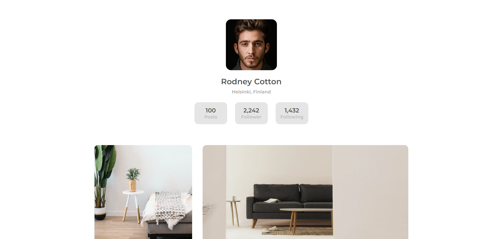
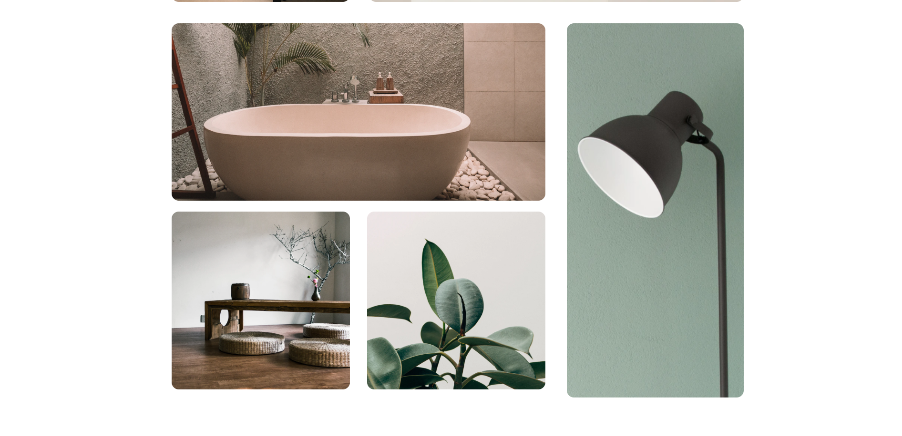
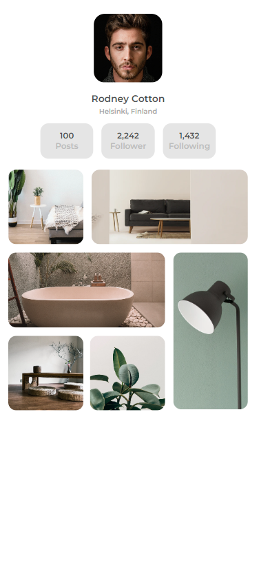

Nesse projeto, criei um site de uma galeria de imagens para uma pessoa aleatória, focando em praticar minhas habilidades de responsividade com HTML e CSS.

- Link para acessar o site online: 

<!-- Sumário -->

## Sumário

- [Visualização](#vizualização)
  - [Tecnologias](#tecnologias)
- [Contato](#contato)

<!-- First view -->

## Visualização

### Tecnologias

- HTML
- CSS

## Contato

- GitHub [@enzopdm](https://github.com/enzopdm)
- LinkedIn [@EnzoPereira](https://www.linkedin.com/in/enzo-pereira-a5001a221/)